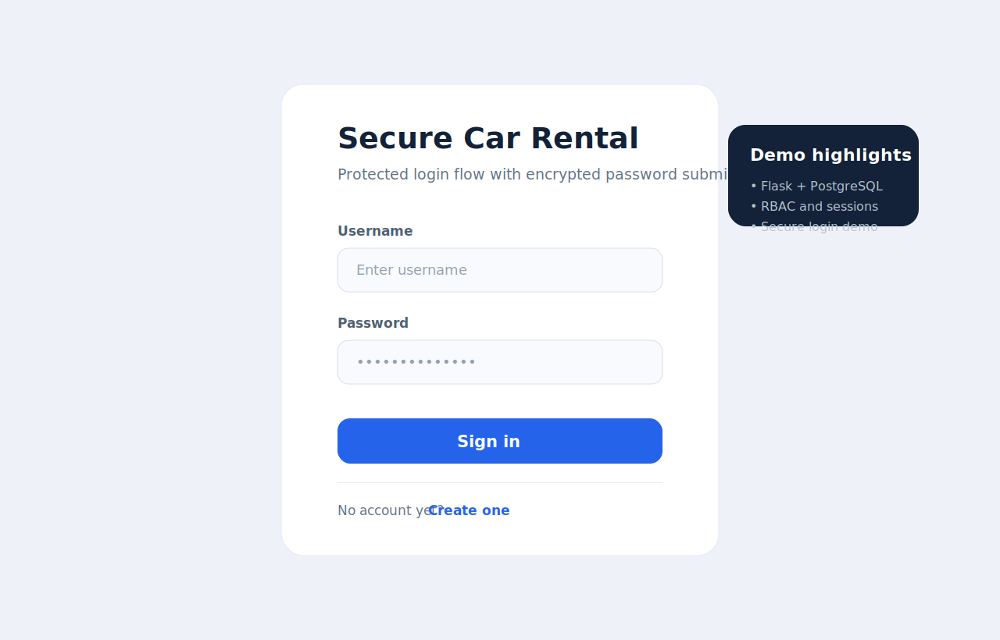

# Secure Car Rental

Educational backend project for a car rental service with authentication, role-based access control, booking workflows, and a lightweight browser client.



## What the project demonstrates

- Flask backend with route separation by domain;
- PostgreSQL integration with explicit schema initialization;
- cookie-based sessions;
- role-based authorization for users, managers, and admins;
- booking lifecycle management;
- an educational secure-login flow based on Diffie-Hellman key exchange and AES encryption in the browser.

## Important note

The secure login flow in this repository is implemented for study purposes. It demonstrates cryptographic primitives and request flow design, but it is not a production-ready replacement for standard HTTPS-based authentication.

## Stack

- Python
- Flask
- PostgreSQL
- psycopg2
- python-dotenv
- cryptography
- Docker Compose
- vanilla HTML/CSS/JavaScript

## Project structure

```text
.
|-- app.py
|-- db.py
|-- docker-compose.yml
|-- requirements.txt
|-- routes/
|   |-- auth.py
|   |-- bookings.py
|   `-- cars.py
|-- schema/
|   |-- init.sql
|   `-- schema.sql
|-- security/
|   |-- auth_utils.py
|   |-- crypto.py
|   |-- dh.py
|   |-- session.py
|   `-- symmetric.py
|-- static/
|   |-- bookings.html
|   |-- cars.html
|   |-- login.html
|   |-- register.html
|   `-- style.css
`-- test/
    `-- test_login_secure.py
```

## Features

- User registration and login
- Role-aware access control
- Car catalog and availability management
- Booking creation and status updates
- Health-check endpoints
- Secure login demo with client-side encryption

## Quick start

1. Create a local environment file:

```bash
copy .env.example .env
```

2. Start PostgreSQL:

```bash
docker compose up -d
```

3. Install dependencies and run the app:

```bash
python -m venv .venv
.venv\Scripts\activate
pip install -r requirements.txt
python app.py
```

4. Open:

- `http://127.0.0.1:5000/login.html`
- `http://127.0.0.1:5000/register.html`

## Preview

The repository includes a lightweight UI preview in [assets/screenshots/login-preview.svg](assets/screenshots/login-preview.svg).

## Demo data

The bootstrap SQL creates:

- base tables for users, roles, sessions, cars, and bookings;
- default roles: `USER`, `MANAGER`, `ADMIN`;
- a small set of demo cars for manual testing.

## Testing the secure login flow

The repository includes an integration-style script:

```bash
python test/test_login_secure.py
```

Before running it, make sure:

- the Flask app is running;
- the test user exists in the database.

## Limitations

- the custom Diffie-Hellman login flow is educational only;
- passwords are hashed with salted SHA-256 for study purposes, not with a stronger password hashing scheme such as Argon2 or bcrypt;
- there is no production deployment configuration in this repository.
